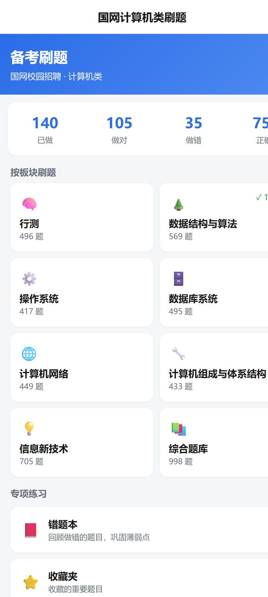
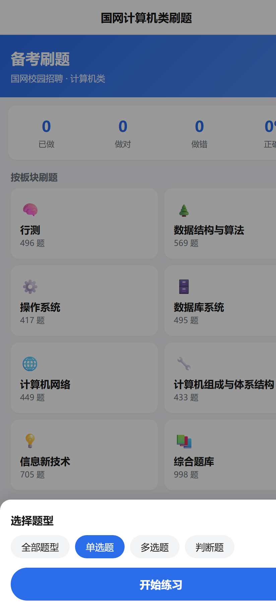
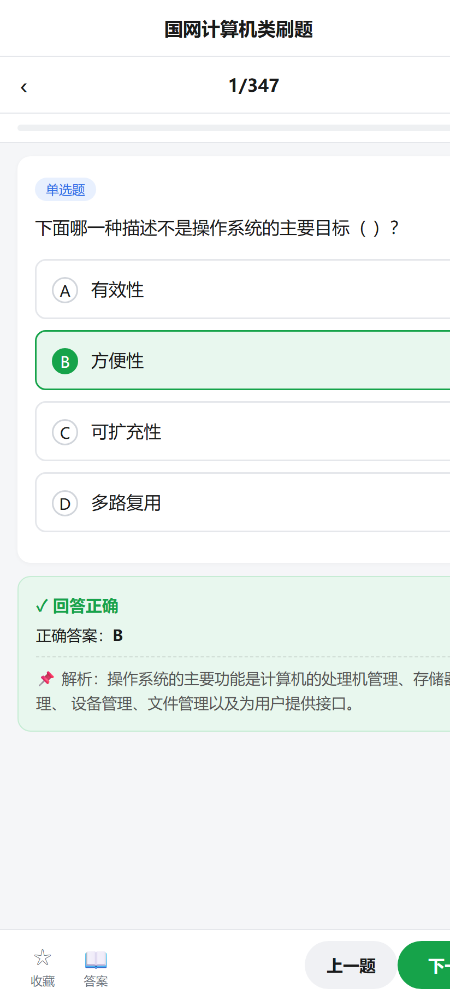
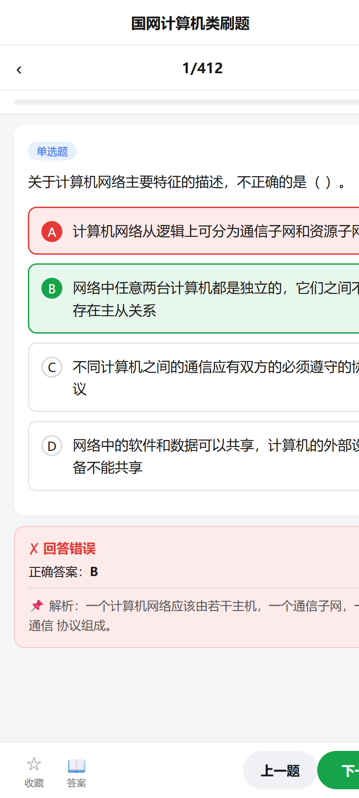
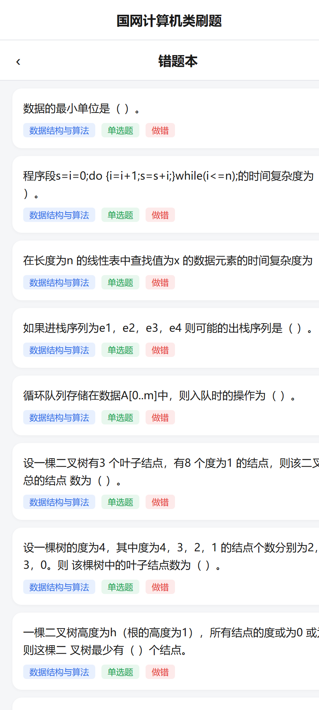

# 国网计算机类刷题 (GuoWang Computer Quiz)

<div align="center">

🧠 国家电网校园招聘 · 计算机类 · 离线刷题应用

`4562+ 道真题题库` `仿粉笔模式` `纯离线` `单文件 HTML + Android APK`


</div>

---

## 📸 预览

| 首页 | 题型筛选 | 答题（答对） |
|:---:|:---:|:---:|
|  |  |  |

| 答题（答错+解析） | 错题本 |
|:---:|:---:|
|  |  |

## ✨ 功能特性

- **📚 板块刷题**：行测、数据结构与算法、操作系统、数据库系统、计算机网络、计算机组成与体系结构、信息新技术、综合题库，共 8 大板块
- **🎯 题型筛选**：单选题 / 多选题 / 判断题自由组合练习
- **⬅️➡️ 上一题 / 下一题**：底部固定按钮随时切换，第一题自动置灰上一题
- **⚡ 答对自动跳转**：单选/判断答对后 0.8 秒自动进入下一题，答错停留查看解析
- **🟢🔴 对错标记**：答对绿色高亮、答错红色高亮并显示正确答案与解析（仿粉笔风格）
- **⭐ 收藏夹**：重点题目一键收藏，随时回顾
- **📕 错题本**：自动收集做错的题目，巩固薄弱环节
- **💾 进度持久化**：localStorage 本地保存做题记录，退出重开进度不丢
- **🚫 无答案题目处理**：源资料缺失答案的题目标记「暂无答案」，可作答但不判分
- **📴 完全离线**：题库内嵌，无网络也能刷题

## 📊 题库概况

| 项目 | 数量 |
|---|---:|
| 总题数 | **4562** |
| 有答案 | 3498 |
| 无答案 | 1064 |
| 单选题 | 4188 |
| 多选题 | 194 |
| 判断题 | 180 |

| 板块 | 题数 | | 板块 | 题数 |
|---|---:|---|---|---:|
| 综合题库 | 998 | | 数据库系统 | 495 |
| 信息新技术 | 705 | | 计算机网络 | 449 |
| 数据结构与算法 | 569 | | 计算机组成与体系结构 | 433 |
| 行测 | 496 | | 操作系统 | 417 |

## 🚀 快速开始

### 方式一：直接安装 APK（推荐）

从 [`release/`](release/) 目录下载 `guowang-computer-quiz-v1.0.apk`，传到 Android 手机安装即可。

> 首次安装系统会提示「未知来源应用」，在设置中允许安装即可（自签名 APK 的正常提示）。

### 方式二：网页版（单文件 HTML）

下载 [`web/index.html`](web/index.html)，双击用任意现代浏览器打开即可使用，数据同样内嵌。

```bash
# 或者起个本地服务
python -m http.server 8000
# 浏览器访问 http://localhost:8000/web/index.html
```

### 方式三：自己动手构建 APK

见下方「Android 构建」章节。

## 🔧 数据管线（从 PDF 到题库）

本项目包含一套完整的**题库提取管线**，可将 PDF 题库资料自动转为结构化 JSON：

```
PDF 题库资料
   │
   ├─ 有文字层 ──► extract2.py ────┐
   │   (pypdf 文本抽取)            │
   │                               ├──► clean.py ──► questions.json ──► build_data.py ──► index.html
   └─ 纯扫描件 ──► ocr_extract.py ─┘    (合并去重)      (4562 题)        (数据内嵌)      (单文件应用)
       (pymupdf 渲染图片
        + RapidOCR 识别)
```

| 脚本 | 作用 |
|---|---|
| `web/extract2.py` | 从有文字层的 PDF 抽取题目（题干/选项/答案/解析/题型/板块） |
| `web/ocr_extract.py` | 扫描件 OCR 管线，支持**断点续跑**（`data/ocr_cache.json` 缓存）与容错 |
| `web/clean.py` | 合并文字层 + OCR 两路数据，按题干+选项去重 |
| `web/build_data.py` | 将题目数据内嵌进 HTML 模板，产出单文件 `index.html` |

> 无答案的题目会被保留并标记为「暂无答案」，App 中可作答但不判分。

## 🤖 Android 构建指南

`android/` 是一个标准 Gradle 项目：原生壳（MainActivity + WebView）加载内嵌的 `index.html`。

### 环境要求

- JDK 17（Temurin / Oracle 均可）
- Android SDK（Platform 34 + Build-Tools 34，缺什么 Gradle 会自动补装）
- Gradle 8.5（可用 wrapper 或直接下载发行版）

### 构建步骤

```bash
cd android

# 1. 配置 SDK 路径（Windows 示例）
echo "sdk.dir=C\:\\Users\\<你的用户名>\\AppData\\Local\\Android\\Sdk" > local.properties

# 2. 生成自己的签名密钥
keytool -genkeypair -v -keystore app/release.keystore -alias your_alias \
  -keyalg RSA -keysize 2048 -validity 10000 \
  -storepass 你的密码 -dname "CN=YourName, C=CN"

# 3. 修改 app/build.gradle 中 signingConfigs.release 的密码与 alias

# 4. 构建 Release APK
gradle assembleRelease
# 产物：app/build/outputs/apk/release/app-release.apk
```

### ⚠️ 踩坑记录（Windows 实测）

| 坑 | 现象 | 解决 |
|---|---|---|
| 路径含中文/非 ASCII 字符 | `Your project path contains non-ASCII characters` 构建失败 | `gradle.properties` 加 `android.overridePathCheck=true` |
| AGP 与 compileSdk 不匹配 | `Failed to find Platform SDK with path: platforms;android-37` | AGP 8.2.2 最高支持 compileSdk 34，把 `compileSdk`/`targetSdk` 降到 34，Gradle 会自动补装 platform-34 |
| 大文件下载中断 | Gradle/依赖下载超时 | `curl -C -` 断点续传；配置国内镜像加速 |

### 应用图标

`android/gen_icon.py` 用 Pillow 程序化生成各分辨率图标（蓝底白色书本图案），运行一次即可重新生成。

## 📁 项目结构

```
guowang-computer-quiz/
├── web/                        # 数据管线 + 网页版
│   ├── index.html              # ⭐ 单文件成品（题库已内嵌，直接打开即用）
│   ├── index_template.html     # HTML 模板（数据注入点）
│   ├── extract2.py             # 文字层 PDF 题目抽取
│   ├── ocr_extract.py          # 扫描件 OCR（断点续跑）
│   ├── clean.py                # 合并去重
│   ├── build_data.py           # 数据内嵌构建
│   └── data/
│       ├── questions.json      # ⭐ 结构化题库（4562 题）
│       └── questions.js        # JS 版题库
├── android/                    # Android 原生壳（WebView）
│   ├── app/
│   │   ├── src/main/
│   │   │   ├── java/com/wangdian/quiz/MainActivity.java
│   │   │   ├── assets/index.html      # 内嵌的单文件应用
│   │   │   └── res/                   # 图标与主题资源
│   │   └── build.gradle
│   ├── build.gradle / settings.gradle
│   └── gen_icon.py             # 图标生成脚本
├── release/
│   └── guowang-computer-quiz-v1.0.apk   # ⭐ 成品安装包（~3MB）
├── screenshots/                # README 截图
└── gen_screenshots.py          # 截图自动生成脚本（Edge headless）
```

## 🛠️ 技术栈

| 层 | 技术 |
|---|---|
| 前端 | 原生 HTML/CSS/JS，零依赖单文件，localStorage 持久化 |
| OCR | pymupdf（PDF→图片）+ RapidOCR onnxruntime（图像→文字） |
| PDF 解析 | pypdf（文字层抽取） |
| Android | Java + WebView，minSdk 23 / targetSdk 34 |
| 构建 | Gradle 8.5 + AGP 8.2.2，JDK 17 |
| 工具 | Pillow（图标生成）、Edge Headless（截图自动化） |

## ❓ 常见问题

**Q：换手机/清浏览器缓存后进度会丢吗？**
A：会。进度存在设备本地（localStorage），暂未做云同步。可通过系统备份恢复。

**Q：为什么有些题显示「暂无答案」？**
A：这部分题目来自纸质题库的扫描件，原书没有附答案（如创享/衡真系列题库）。App 会正常收录并记录你的作答，只是不做对错判定。

**Q：答案准确吗？**
A：答案来自原始资料的配套答案文件，程序只做抽取与匹配，未人工校对全量题目。发现个别错误属正常，以教材为准。

**Q：iOS 能用吗？**
A：网页版 `web/index.html` 可以用 Safari 打开使用（数据同样本地保存），但没有原生壳。

## ⚠️ 免责声明

本项目题库来源于个人备考资料的整理与 OCR 识别，仅供**个人学习备考**使用，不得用于任何商业用途。题目著作权归原出版机构/命题方所有，如有侵权请联系删除。本项目与国家电网公司无任何关联。

## 📄 License

[MIT](LICENSE)
